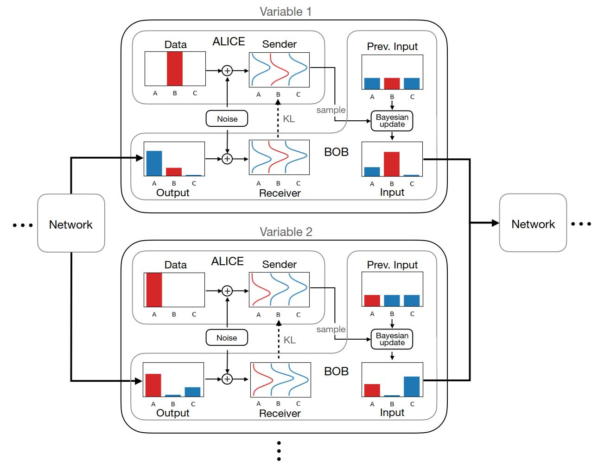

# Bayesian Flow Networks

## Links

* [Arxiv Link](https://arxiv.org/abs/2308.07037)
* Eleuther Diffusion Reading Group Talk #33

## Motivations & Goals

* BFN is a general framework to think about generative modelling
    * More from information theory perspective
    * Exchange of messages between a sender and a reciever
* Propose a solution to discrete data modelling
    * Noise in diffusion is discrete, thus discontinuous / non-differnetiable
* BFN addresses this by operating on the paramets of a data distribution as opposed to on a noised version of the data itself.
    * parameters of a distribution allow for fully continuous process

## Bayesian Inference

$$
\textcolor{orange}{p(\theta \mid x)} = \frac{\textcolor{green}{p(x \mid \theta)} \thinspace \textcolor{blue}{p(\theta)}}{\textcolor{brown}{p(x)}}
$$

* $\textcolor{orange}{p(\theta \mid x)}$ __➡️ Posterior__
    * Probability distibution of the parameter given the observed data
    * _"How probvable are each value of the paremeter given the observed data?"_
* $\textcolor{green}{p(x \mid \theta)}$ __➡️ Likelihood__
    * Probability distribution of the observed data given a parameter value
    * _"How probable are the observed data for this parameter value?"_
* $\textcolor{blue}{p(\theta)}$ __➡️ Prior__
    * Probability distribution of the parameter independently from any observation
    * _"How probable are each value of the parameter before any observation?"_
* $\textcolor{brown}{p(x)}$ __➡️ Evidence__
    * Probability distribution of the observed data independantly fram any parameter value
    * _"How probablie is it to observe this particular data?"_

## Bayesian Flow Network Architecture Diagram

## Different Distributions

* __Input Distribution__: $p_I(x \mid \theta)$
* __Sender Distribution__: $p_S(y \mid x;\thinspace\alpha)$
* __Output Distribution__: $p_O(x \mid \theta; \thinspace t)$
* __Receiver Distribution__: $p_R(y \mid \theta ; \thinspace t, \alpha)$
* __Bayesian Update Distribution__: $p_U(\theta ' \mid \theta, x;\thinspace \alpha)$
* __Bayesian Flow Distribution__: $p_F(\theta \mid x;\thinspace t)$

### Input Distribution

Given D-dimensional data $x = (x^{(1)},...,x^{(D)}) \in \mathcal{X}^D$, let $\theta = (\theta^{(1)},...,\theta^{(D)})$ be the parameters of the factorised _input distribution_ $p_I(\cdot \mid \theta)$, with:

$$
p_I(x \mid \theta) = \prod_{d=1}^D \thinspace p_I(x^{(d)} \mid \theta^{(d)})
$$

__TL;DR;__ this is basically saying, given some parameters, i.e. mean and variance, here is the distribution from which you can sample.

### Sender Distribution

$$
p_S(y \mid x;\thinspace\alpha) = \prod_{d=1}^D \thinspace p_S(y^{(d)} \mid x^{(d)};\thinspace \alpha)
$$

where $\alpha \in \mathbb{R}^+$ is an _accuracy_ parameter defined such that when:
    
* `alpha == 0` : The sender samples are entirely uninformative about $x$ (i.e. pure noise)
* `alpha > 0` : The samples are increasingly informative about $x$ (i.e. at the extreme, just returns $x$)

Another way to think of accuracy is as similar to a noising paremeter that you'd see in diffusion.

### Output Distribution

* $\Psi(\theta , t)$ is a neural network that we are training.  It looks at all of $\theta$ and $x$.
* $(\Psi^{(1)}(\theta , t),...,\Psi^{(D)}(\theta , t))$ which is used to paremeterise an _output distribution_ factorised in the same way as the input and sender distributions

$$
p_O(x \mid \theta; \thinspace t) = \prod_{d=1}^D \thinspace p_O(x^{(d)} \mid \Psi^{(d)}(\theta , t))
$$

### Receiver Distribution

Receiver distribution is like the sender distribution, but you don't have the actual data points; You instead sample your data points from the output distribution.

$$
p_R(y \mid \theta ; \thinspace t, \alpha) = \underset{p_O(x' \mid \theta ; \thinspace t)}{\mathbb{E}} \thinspace p_S(y \mid x' ; \thinspace \alpha)
$$

i.e. Adding noise (a distribution in a similar from to the sender distribution) to the samples by the parameterized output distribution.

### Bayesian Update Distribution

given parameters $\theta$ and sender sample $y$ drawn with accuracy $\alpha$, the _Bayesian Update function_ $h$ is derived by applying the rules of Bayesian inference to compute the updated parameters $\theta '$:

$$
\theta ' \leftarrow h(\theta , y, \alpha )
$$

The _Bayesian update distribtuion_ $p_U(\cdot \mid \theta, x;\thinspace \alpha)$ is then defined by marginilizing out $y$:

$$
p_U(\theta ' \mid \theta, x;\thinspace \alpha) = \underset{p_S(y \mid x ; \alpha)}{\mathbb{E}} \thickspace \delta ( \theta ' - h( \theta , y , \alpha ))
$$

Using Bayes' Rule to obtain the next estimate of $\theta$

Bayesian update distirbution is defined such that $\theta '$ is the only possible value to sample the distribution from.

#### Additive property of the Bayesian Update Distribution

_See Paper for full proof_

Where $\delta ( \cdot - a)$ is the multivariate Dirac delta distribution centered on the vector $a$, in sections 4.4 and 6.7 we will prove that both forms of $p_U( \cdot \mid \thinspace \theta , x ; \alpha)$ considered in this paper have the following property: the accuracies are additive in the sense that if $\alpha = \alpha_a + \alpha_b$ then:

$$
p_U(\theta '' \mid \theta , x ; \alpha) = \underset{p_U(\theta ' \mid \theta , x ; \alpha_a)}{\mathbb{E}} \thickspace p_U(\theta '' \mid \theta ' , x ; \alpha_b)
$$

### Bayesian Flow Distribution

Given prior parameters $\theta_0$, Bayesian update distribtuion $p_U( \cdot \mid \theta , x ; \alpha)$ and accuracy schedule $\beta(t)$ the _Bayesian Flow Distribution_ $p_F( \cdot \mid x ; t)$ is the marginal distribution over input parameters at time $t$, defined by:

$$
p_F(\theta \mid x;\thinspace t) = p_U(\theta \mid \theta_0 , x ; \beta (t))
$$